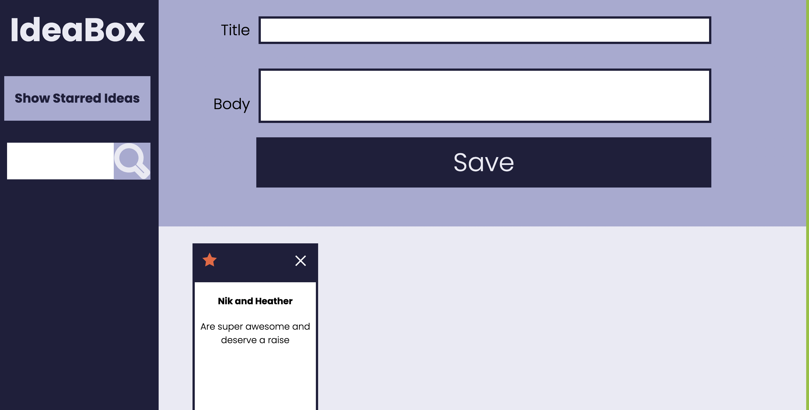

# Ideabox
### Abstract:
We made a web application (deployed website linked [here](https://pareesakd1118.github.io/ideaBox/)) in which users can log their "good ideas" with both a title and body/description of the idea. The ideas render as "cards" on the DOM once the user inputs values for the title/body of the idea and presses the save button. The web app has several features, including:
- The user is able to delete one of the ideas by clicking the X icon on each individual card
- The user is able to favorite an idea by clicking the star icon on each individual card, in which case the star will turn from white to orange
- The user is able to temporarily remove all "not favorited" ideas from the DOM by clicking the show favorite ideas button so that they can look solely at favorite ideas, and then bring all ideas back by clicking the same button, which will subsequently show a new message: "show all ideas"
- The user is able to search for any particular idea by a word/letters included in the title or body of any idea
- The user is able to add unlimited ideas to the DOM and scroll to see all of them 

### Installation Instructions:
1. Fork this repo and copy the SSH Key
2. Navigate to terminal and run `git clone SSH key`
3. Type `cd ticTacToe` in local terminal to navigate to root directory
4. Type `code .` to open the directory in text editor, or simply type `open index.html` to open the web application

### Preview of App:
 

### Context:
We have been learning javascript for about one month, and HTML/CSS for about three weeks. We spent an average of 4 hours a day for 6 days on this project for a total of 20-30 hours of worktime. 

### Contributors:
- [David Kwon's GitHub](https://github.com/dkwon1223)
- [Pareesa Kamgar-Dayhoff's GitHub](https://github.com/pareesakd1118)
- [Asher Spurr's GitHub](https://github.com/AsherSpurr)
- [Brandon Doza's GitHub](https://github.com/BrandonDoza)

### Learning Goals:
The designated learning goals for this project are as follows:
- Gain an understanding of how to write clean HTML and CSS to match a provided comp
- Understand how a developer might separate the data model from the DOM model
- Incorporate & iterate over arrays in order to filter what is being displayed
- Craft code with clean style, using small functions that show trends toward DRYness, SRP, and purity

### Wins + Challenges:
One challenge that was also a win was when a group member deviated from the previously defined working boundaries/expectations (aka DTR) and we had a long, kind and informative discussion about it, which was also something we previously decided we would do in the event of a deviation from the DTR and we all agree that we are better for it moving forward.

Individual wins and challenges included feeling more solid in using the git workflow and understanding the use of the data model to render the DOM. 
